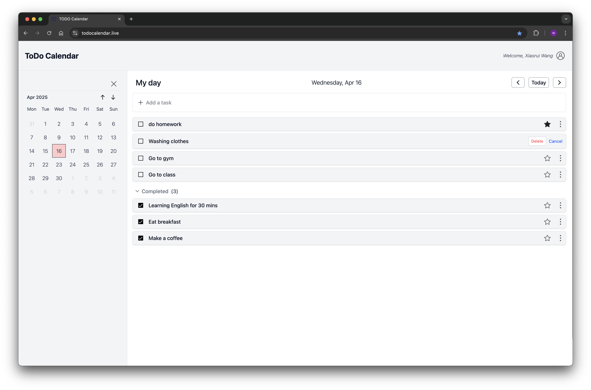
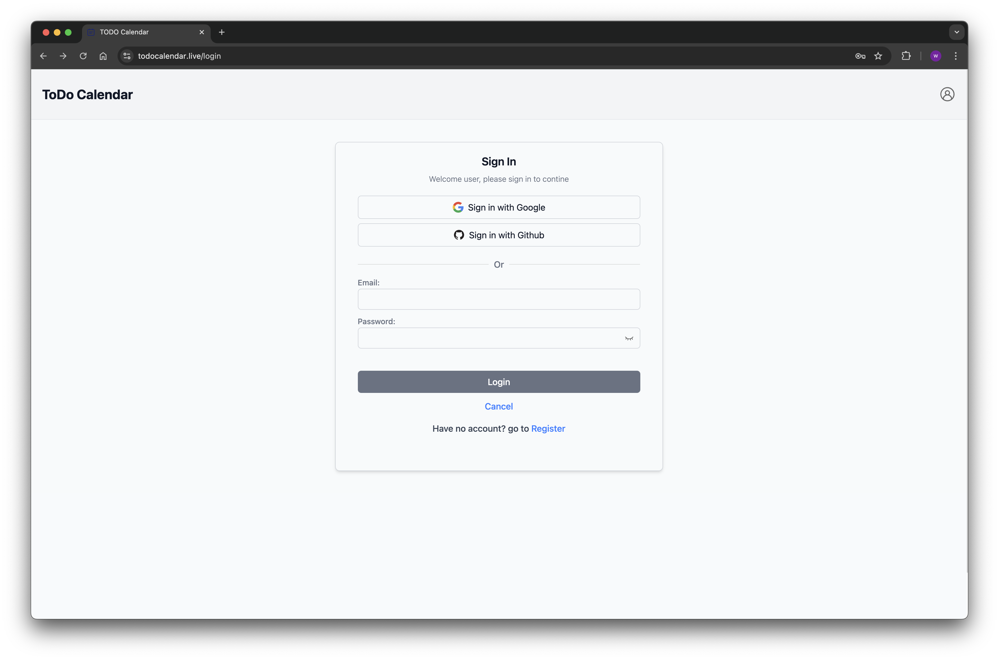
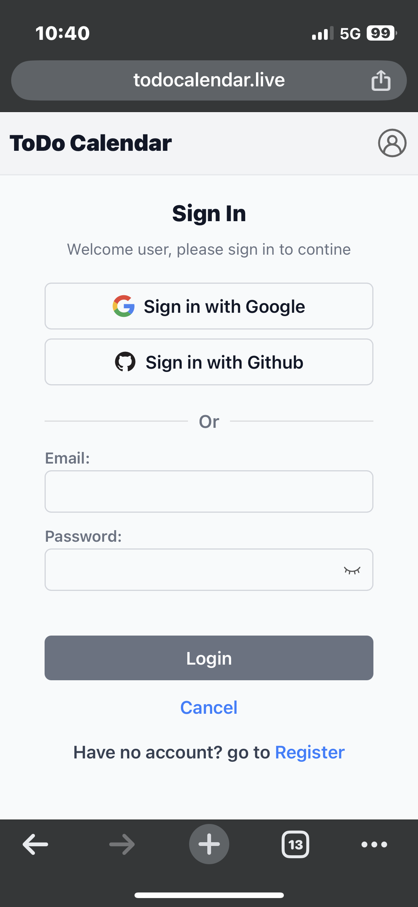
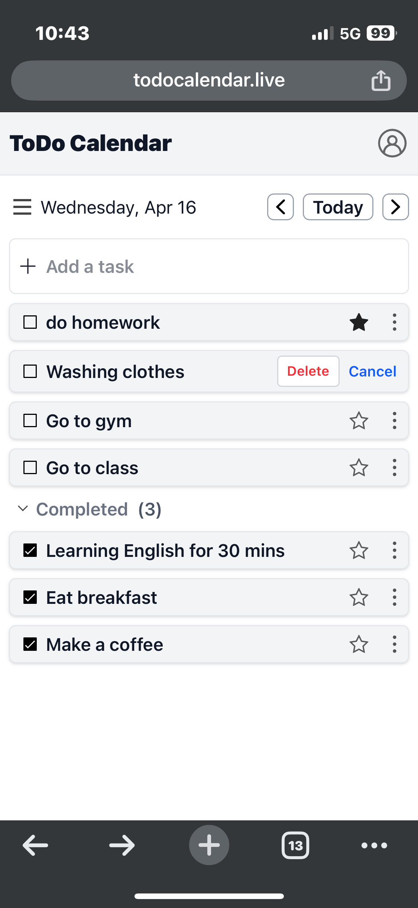
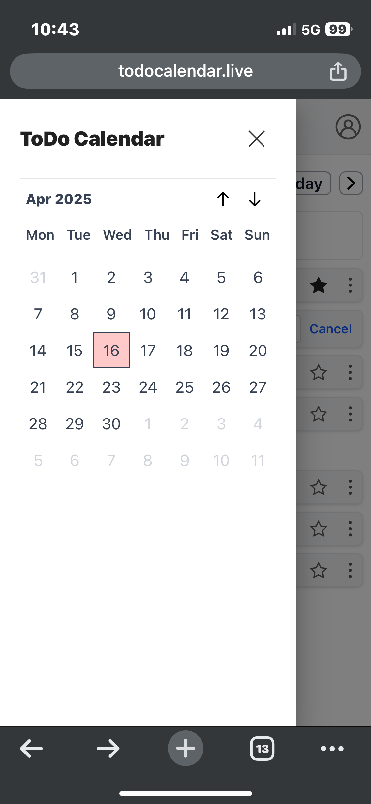

<!--
 * @Author: Xiaorui Wang
 * @Email: xiaorui.wang@usi.ch
 * @Date: 2025-03-10 13:21:38
 * @LastEditors: Xiaorui Wang
 * @LastEditTime: 2025-04-16 12:05:11
 * @Description: 
 * Copyright (c) 2025 by Xiaorui Wang, All Rights Reserved. 
-->
# TODO-Calendar

A modern and intuitive calendar application that helps you manage your tasks and schedule effectively. Built with React and TypeScript for the frontend, backed by a robust Spring Boot backend. This application combines the functionality of a traditional calendar with a powerful todo list manager, featuring OAuth2 authentication and real-time updates.

## Quick Links
- 🌐 Official Website: [https://todocalendar.live](https://todocalendar.live)
- 🔧 Backend Repository: [TODO-Calendar-backend](https://github.com/XiaoruiWang-SH/TODO-Calendar-backend) (See backend repository for detailed backend documentation)

## System Architecture
The project is split into two main components:
- **Frontend (This Repository)**: React-based single-page application
- **Backend**: Spring Boot application providing RESTful APIs with JWT authentication and OAuth2 support

PC:
<div style="display: flex; justify-content: space-between;">
  
  
</div>

Mobile:
<div style="display: flex; justify-content: space-between;">
  
  
  
</div>

## Features

- 📅 Interactive Calendar View
- ✅ Task Management
- ⭐ Important Task Marking
- 🔄 Real-time Updates
- 📱 Responsive Design
- 🎨 Modern UI with Tailwind CSS
- 🔐 OAuth2 Authentication (Google & GitHub)

## Frontend Technology Stack

- React 19
- TypeScript
- Redux Toolkit for state management
- React Router for navigation
- Tailwind CSS for styling
- Vite for build tooling

## Getting Started

### Prerequisites
- Node.js (Latest LTS version recommended)
- npm or yarn package manager

### Installation

1. Clone the repository
```bash
git clone https://github.com/yourusername/TODO-Calendar.git
cd TODO-Calendar
```

2. Install dependencies
```bash
npm install
```

3. Start the development server
```bash
npm run dev
```
run application on your browser `http://localhost:5173`

```bash
npm run dev_build
```
build application with 'vite.config.dev.js' config in development mode

```bash
npm run build
```
build application with 'vite.config.prod.js' config in production mode


## Project Structure

```
TODO-Calendar/
├── public/              # Static files
├── src/                # Source code
│   ├── app/           # Redux store configuration
│   ├── assets/        # Images and icons
│   ├── components/    # React components
│   ├── features/      # Redux slices and features
│   └── types/         # TypeScript type definitions
├── .env.dev           # Development environment variables
├── .env.prod          # Production environment variables
├── vite.config.dev.js # Development Vite configuration
├── vite.config.prod.js # Production Vite configuration
├── tsconfig.json      # TypeScript configuration
└── package.json       # Project dependencies
```

## Contributing

Contributions are welcome! Please feel free to submit a Pull Request.

## License

This project is licensed under the MIT License - see the LICENSE file for details.

## Author

Xiaorui Wang (xiaorui.wang@usi.ch)

## Acknowledgments

Special thanks to all contributors who have helped to improve this project.
